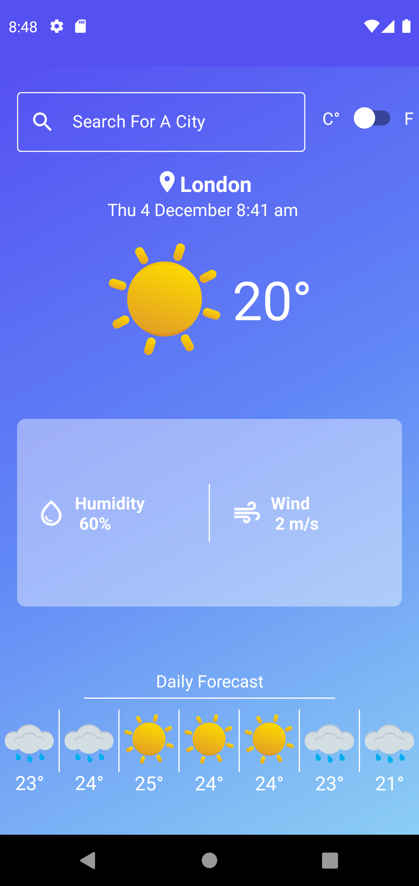
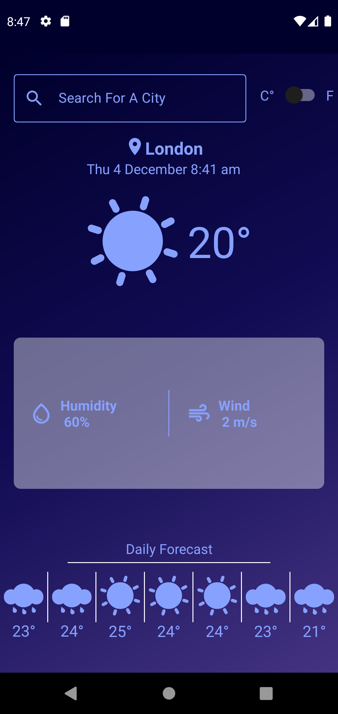
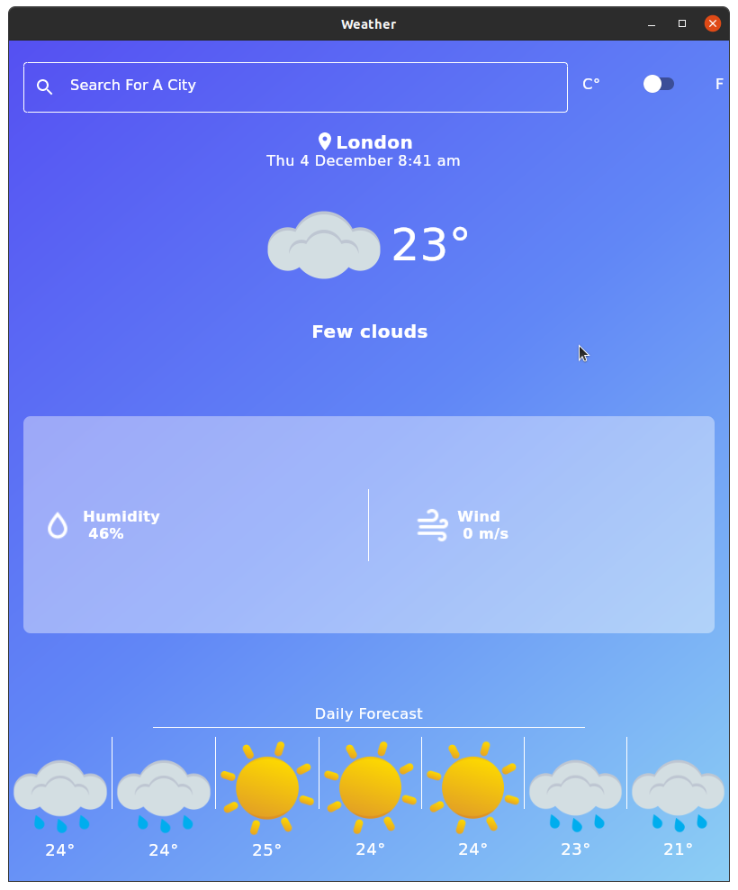
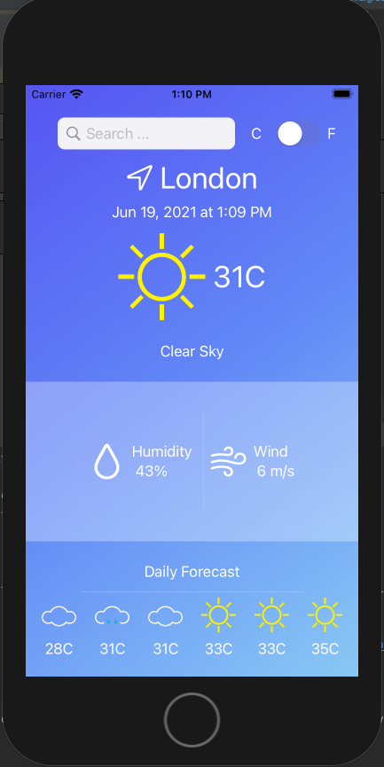

# Kotlin Multiplatform Sample Weather App

This is a sample weather app made to play around with Kotlin Multiplatform. I tried to strive for maximum code sharing between platforms, all the business logic is shared. Only thing that is platform depended is the native UI. Jetpack Compose for Desktop and Android and SwiftUI for IOS.

This kind of architecture is only achiveable thanks to the work of 
Arkadii Ivanov and his libraries [Decompose](https://github.com/arkivanov/Decompose) and [MVIKotlin](https://github.com/arkivanov/MVIKotlin).

Kotlin Multiplatform and libraries supporting it are highly violatile at the moment and in the early stages of development. It can be kinda a pain in the bottom to work with but nevertheless it has been a great experience. I can't wait to see what the future holds, I truly believe this will be the future of cross platform development. Just thinking about using Kotlin to develop a codebase shared across platforms is almost like a dream.

## UI 

The Android and Desktop app share most of the UI code that resides in the :common:compose-ui. There are slight platform specific implementations that allow for dark mode support on Android. Besides that, it's super easy to develop a single UI and have it work on Android and Desktop.

The IOS UI is made with the help of SwiftUI and considering it's pretty similar to Jetpack Compose it's also an easy switch. You can pretty much just go and 1 to 1 copy the Compose code with the respected SwiftUI alternatives.

## Demo

### Android app

 &nbsp; &nbsp; &nbsp; &nbsp; &nbsp; &nbsp; &nbsp; &nbsp;   

Light Mode  &nbsp; &nbsp; &nbsp; &nbsp;&nbsp; &nbsp; &nbsp; &nbsp; &nbsp; &nbsp; &nbsp; &nbsp; &nbsp; &nbsp; &nbsp; &nbsp; &nbsp; &nbsp; &nbsp; &nbsp; &nbsp; &nbsp; &nbsp; &nbsp; &nbsp; &nbsp;&nbsp; &nbsp; &nbsp; &nbsp; Dark Mode

### Desktop app

### Ios app

  
## Shared code

With the help of the amazing libraries from [Arkadii Ivanov](https://github.com/arkivanov) like [MVIKotlin](https://github.com/arkivanov/MVIKotlin) and [Decompose](https://github.com/arkivanov/Decompose) sharing 90%+ of the business logic is achieveable. Currently, albeit a simple Weather app, I am using the exact same models, logic, use-cases for all platforms. That means, with the single common module I am able to have the same logic running on Android, Ios and Desktop (Mac, Linux and Windows!). Which makes testing easier, development (as most of the apps share functionality across platforms) and it's just nice to write in Kotlin.
